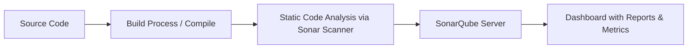

#  SonarQube Documentation


|  Created     |  Version |  Author         |  Comment              |  Reviewer       |
|--------------|----------|------------------|------------------------|-----------------|
| 18-04-2025   | V1       | Vardaan Saxena   | Internal Documentation | Pritam Sharma   |

---

##  Table of Contents

1. [Intro](#intro)  
2. [Why SonarQube?](#why-sonarqube)  
3. [What is SonarQube?](#what-is-sonarqube)  
4. [Advantages](#advantages)  
5. [Disadvantages](#disadvantages)  
6. [How SonarQube Works (Workflow)](#workflow)  
7. [Installing SonarQube](#installing-sonarqube)  
8. [CI/CD Integration Example](#ci-cd-integration-example)  
9. [Best Practices](#best-practices)  
10. [Troubleshooting](#troubleshooting)  
11. [References](#references)  
12. [Contacts](#contacts)  
13. [Conclusion](#conclusion)  

---

## Intro <a id="intro"></a>

This document provides a complete overview of **SonarQube**, an open-source platform used to continuously inspect the quality of source code. It includes setup instructions, CI/CD integration examples, and best practices.

---

## Why SonarQube? <a id="why-sonarqube"></a>

- 🔹 Helps maintain **code quality** and **security**  
- 🔹 Detects **bugs, vulnerabilities, code smells** early  
- 🔹 Promotes **clean code** and **technical debt management**  
- 🔹 Seamless integration with **CI/CD tools**  
- 🔹 Supports **multiple programming languages**

---

## What is SonarQube? <a id="what-is-sonarqube"></a>

**SonarQube** is a self-hosted platform that continuously analyzes source code for **quality, security, maintainability**, and **code smells**. It offers a detailed dashboard that helps developers and teams improve code health over time.

---

## Advantages <a id="advantages"></a>

✅ Automates code review  
✅ Supports over 25+ programming languages  
✅ Integrates with Jenkins, GitHub Actions, GitLab CI, Azure DevOps  
✅ Generates code quality reports and trend graphs  
✅ Customizable quality gates and rules

---

## Disadvantages <a id="disadvantages"></a>

❌ Initial setup and maintenance overhead  
❌ Requires a dedicated server and resources  
❌ Some advanced features are locked in paid versions  
❌ Might generate **false positives** in static analysis

---

## How SonarQube Works (Workflow) <a id="workflow"></a>



- Code is analyzed using **SonarScanner** during build.  
- Results are pushed to the **SonarQube server**.  
- Users view results on the **dashboard** and take action.

---

## Installing SonarQube <a id="installing-sonarqube"></a>

### 1️⃣ Install Java (required for SonarQube):

```bash
sudo apt update
sudo apt install openjdk-17-jdk -y
```

### 2️⃣ Download and Extract SonarQube:

```bash
wget https://binaries.sonarsource.com/Distribution/sonarqube/sonarqube-10.4.1.88267.zip
unzip sonarqube-10.4.1.88267.zip
```

### 3️⃣ Start SonarQube:

```bash
cd sonarqube-10.4.1.88267/bin/linux-x86-64
./sonar.sh start
```

> Access Dashboard: http://localhost:9000 (Default: admin / admin)

---

## CI/CD Integration Example <a id="ci-cd-integration-example"></a>

### ✅ Jenkins Pipeline Example:

```groovy
stage('SonarQube Analysis') {
  steps {
    withSonarQubeEnv('MySonarQubeServer') {
      sh 'mvn clean verify sonar:sonar'
    }
  }
}
```

### ✅ GitHub Actions Example:

```yaml
name: SonarQube Scan
on:
  push:
    branches: [ main ]

jobs:
  sonarqube:
    runs-on: ubuntu-latest
    steps:
      - uses: actions/checkout@v2
      - name: SonarQube Scan
        uses: sonarsource/sonarqube-scan-action@v1.0
        with:
          projectBaseDir: .
        env:
          SONAR_TOKEN: ${{ secrets.SONAR_TOKEN }}
          SONAR_HOST_URL: https://sonarcloud.io
```

---

## Best Practices <a id="best-practices"></a>

- 🟢 Always define **quality gates** to enforce pass/fail conditions  
- 🟢 Integrate in **PR (Pull Request) stage** to catch issues early  
- 🟢 Regularly update rules and plugins  
- 🟢 Keep **false positives** reviewed and suppressed  
- 🟢 Set up email alerts for critical issues

---

## Troubleshooting <a id="troubleshooting"></a>

- 🔧 **SonarQube not starting?** → Check Java version and logs (`/logs/sonar.log`)  
- 🔧 **Token invalid?** → Regenerate from dashboard under *My Account > Security*  
- 🔧 **Scanner not recognized?** → Ensure `sonar-scanner` is in your `$PATH`  
- 🔧 **Dashboard unreachable?** → Ensure port 9000 is open and service is running

---

## References <a id="references"></a>

- 🌐 [Official SonarQube Documentation](https://docs.sonarsource.com)  
- 🌐 [SonarScanner CLI](https://docs.sonarsource.com/sonarqube/latest/analyzing-source-code/scanners/sonarscanner/)  
- 🌐 [SonarQube GitHub Action](https://github.com/SonarSource/sonarqube-scan-action)  
- 🌐 [SonarCloud](https://sonarcloud.io)

---

## Contacts <a id="contacts"></a>

| 👤 Name           | 📧 Email Address                                |
|------------------|--------------------------------------------------|
| Vardaan Saxena   | vardaan.saxena.snaatak@mygurukulam.co           |

---

## Conclusion <a id="conclusion"></a>

SonarQube is an essential tool for ensuring continuous code quality and security in your development lifecycle. With robust integration capabilities and extensive language support, it helps teams deliver maintainable, secure, and clean code. By following the practices and setup provided in this guide, you can confidently implement SonarQube into your CI/CD workflow and achieve higher standards in software development.

